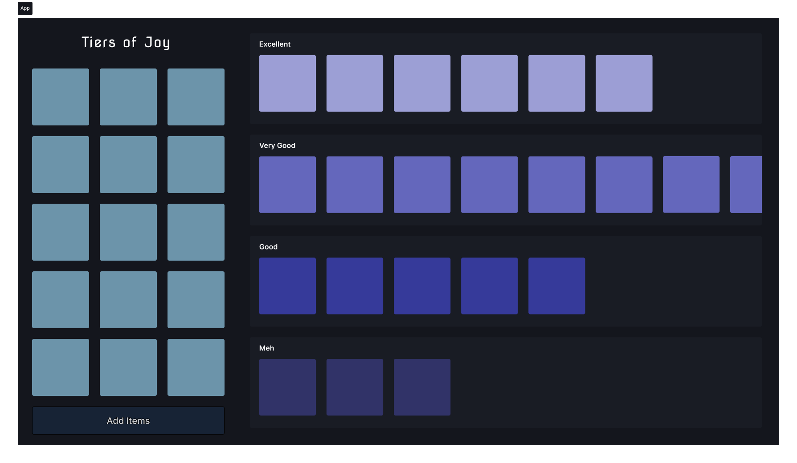

# Tiers of Joy

A tier list maker written in React.

## Figma Design:

## How to use?

1. Enter a bunch of image URLs using add button bottom left corner.
2. Drag and drop image tiles from sidebar to appropriate tier row.

## Demo

[Video coming soon...]
