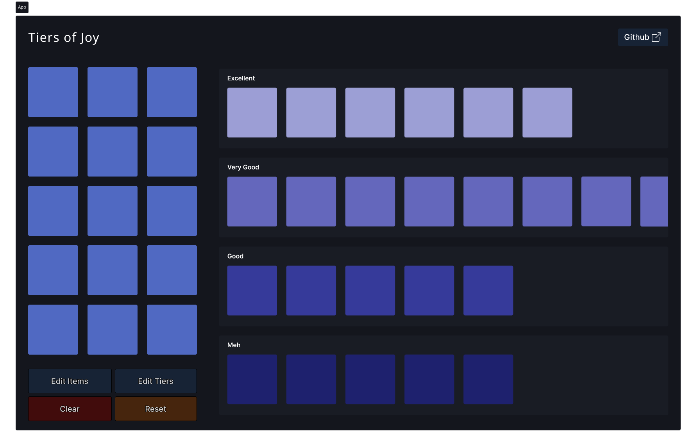
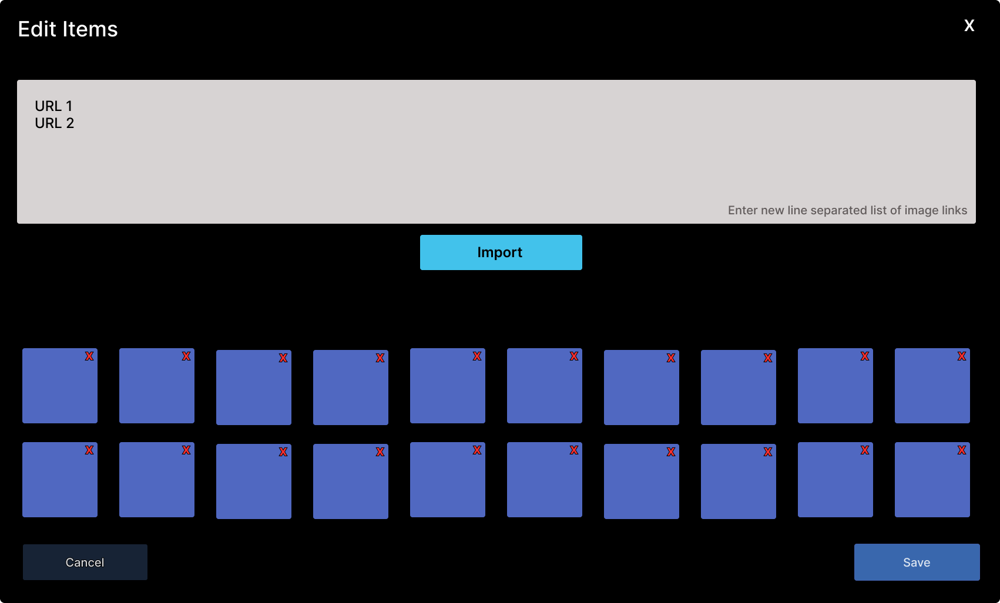
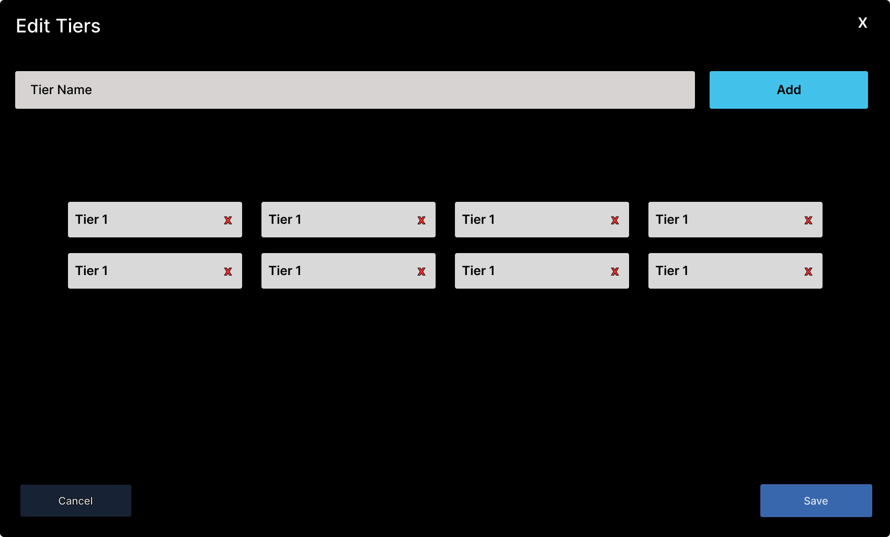

# Tiers of Joy

A tier list maker written in React.

## Figma Design:

## How to use?

1. Enter a bunch of image URLs using `Edit Items` button.
2. Add some categories/tiers using `Edit Tiers` button.
3. Drag and drop image tiles from sidebar to appropriate tier row.

## Demo

> Some web frameworks and ranking tiers are added as default for demo. Clear them using the `Clear` button.

[Video coming soon...]
